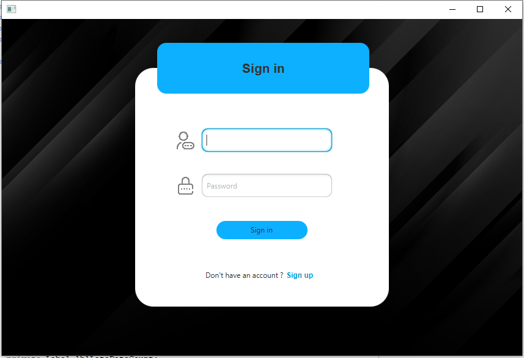
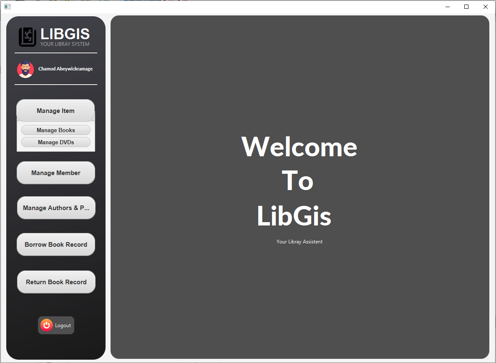
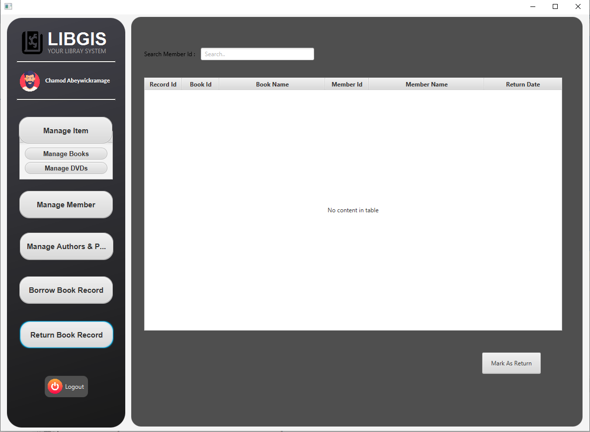
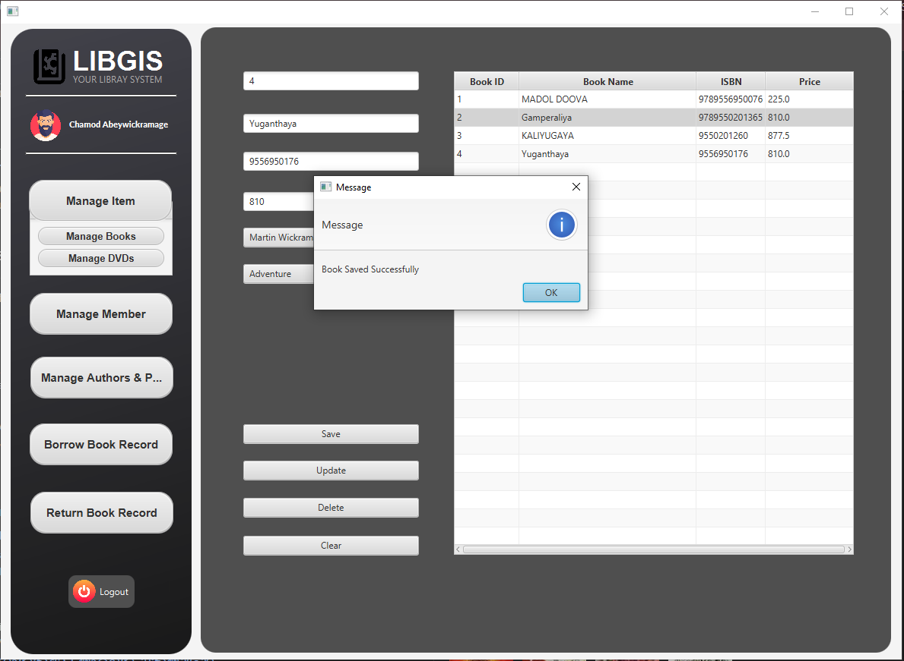
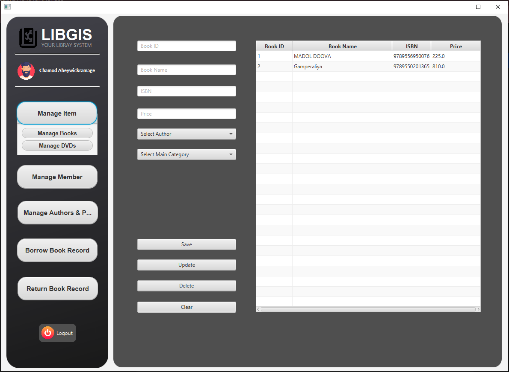

# 📚 Library Management System (LibGIS)

**Follow Me:**
- LinkedIn: [Chamod Abeywickramage](https://www.linkedin.com/in/chamod-abeywickramage/)
- GitHub: [ChamodLa](https://github.com/ChamodLa)


## Table of Contents
- [📖 Project Overview](#project-overview)
- [✨ Features](#features)
- [🏗️ Architecture](#architecture)
- [💻 Technology Stack](#technology-stack)
- [⚙️ Installation](#installation)
- [🔍 How to Use](#how-to-use)
- [📸 Screenshots](#screenshots)
- [🤝 Contributing](#contributing)
- [📜 License](#license)

## 📖 Project Overview
LibGIS is a Library Management System designed to handle the borrowing and returning of books by members of a library. The system helps librarians manage book records and member information efficiently. It provides a user-friendly interface for recording book transactions, updating their statuses, and generating useful data views.

## ✨ Features
- Add, view, and manage book records.
- Track books borrowed by members.
- Mark books as returned and record return dates.
- Display book and member details in transactions.
- Search for book records by book ID or member ID.
- Error handling and user feedback for operations.

## 🏗️ Architecture
LibGIS follows a layered architecture using Maven to structure the project. This architecture separates responsibilities across different layers, promoting a clean and modular design.

- **Entity Layer**: Represents the data structure (e.g., BookRecordReturn).
- **Repository Layer**: Handles database interactions (CRUD operations).
- **Service Layer**: Contains the business logic for managing book records.
- **DTO Layer**: Transfers data between the service layer and the GUI layer.
- **Util Layer**: Contains utility classes like database connections.
- **TM Layer**: Represents data models used in the GUI tables.

## 💻 Technology Stack
- **Java**: Core programming language.
- **JavaFX**: For creating a graphical user interface (GUI).
- **Maven**: For project management and dependency handling.
- **MySQL**: Database used for storing and managing library data.
- **JDBC**: To connect the Java application with the MySQL database.
- **Lombok**: For reducing boilerplate code (e.g., @Data, @AllArgsConstructor, @NoArgsConstructor).

## ⚙️ Installation
1. Clone the repository:
    ```bash
    git clone https://github.com/ChamodLa/Libgis.git
    cd Libgis
    ```

2. Setup the database:
    - Create a MySQL database named `library_management`.
    - Execute the SQL script to create tables (book_record, book, member) and populate sample data.

3. Configure database connection:
    - Update your MySQL database credentials in the `DBConnection.java` file located in the util package:
    ```java
    String url = "jdbc:mysql://localhost:3306/library_management";
    String user = "your_username";
    String password = "your_password";
    ```

4. Build the project with Maven:
    ```bash
    mvn clean install
    ```

5. Run the application:
    - Run the JavaFX main application file to launch the Library Management System interface.

## 🔍 How to Use
- **Adding a Book Record**: Navigate to the "Add Record" tab, fill in the details such as book ID, member ID, borrowed date, etc., and submit the form to add a new record.
- **Viewing Book Records**: Go to the "View Records" section to see all current book transactions. Each record shows the book details, member details, and the return status.
- **Marking a Book as Returned**: Select a book record, mark it as returned, and provide the return date.
- **Searching Records**: Use the search bar to find book records based on book ID or member ID.

## 📸 Screenshots
### Login


### Invalid Password


### Dashboard


### Barrow Book


### Book Delete Confirmation


### Book Delete Successfully


### Book Save Successful


### Book Return


### Book Save Success


### Delete Member Confirmation


### Manage Authors and Directors


### Manage DVD


### Manage Book


### Manage Member


### Return Book Record


### Save Member


### Search Book by ID


### Search Member by ID


### Add to Cart


## 🤝 Contributing
1. Fork the repository.
2. Create a new branch (`git checkout -b feature-branch`).
3. Make your changes.
4. Commit your changes (`git commit -am 'Add new feature'`).
5. Push to the branch (`git push origin feature-branch`).
6. Create a new Pull Request.

## 📜 License
This project is licensed under the MIT License - see the LICENSE file for details.
